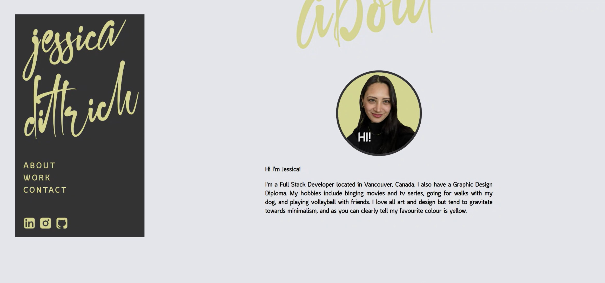

# Jessica Dittrich's Portfolio Website

## Intro
My personal porfolio website created from scratch was made to showcase my current and future work to prospective employers and clients.

## Concept
A minimalist approach was taken to have the focus solely on the content. With a fixed navigation on the right hand side there's easy access to each section as well as icons with links to LinkedIn, Instagram, and GitHub. The colour yellow is promiment throughout because it is my favourite colour.

## The Code
Semantic HTML elements were used as well as "div" tags to create the simple framework but the CSS will show the complicated styling although it creates a minimal look. Flexbox and Media Queries were used to ensure a responsive design across all devices. The contact form was created for easy access to get in touch.

## Artwork
Lettering, icons, and cursors were created by myself to bring a branded touch to my website. The Lounge font family was integrated in as another branded touch. Screenshots of the projects (and placeholder images) were taken and placed in. The background video is a free video from Pexels and has been credited to the artist.

## Engagement
Strategic and fun touches were added to keep engagement on my website. Starting with the colour yellow, it creates a fun and happy vibe. Hovering over my image, the cursor changes to "HI!". Large scripted section titles are intriguing and eye capturing. Links to outside pages are set to deploy in a new tab so that the viewer does not leave my website.

## Notes
Further items to implement include adding in projects once completed, adding in an example photo, and placing links to their deployed pages.

## Final Product
[Click here to view](https://jessicamdittrich.github.io/CHG-JD051722)
